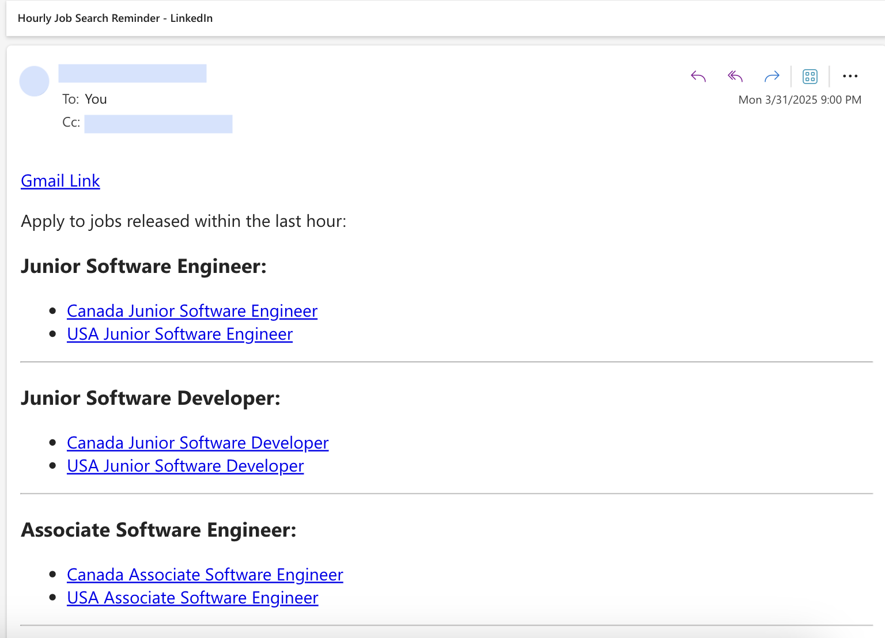

# LinkedIn Job Notifier

An automated tool that sends hourly or overnight email notifications for new LinkedIn job postings matching your search criteria.

## What You'll Get

Here's an example of the notification email you'll receive:



## Features

- Sends hourly job notifications during the day (10am-10pm PST)
- Sends overnight summary (10pm-9am PST)
- Customizable job search terms
- Searches in both USA and Canada job markets
- Runs automatically via GitHub Actions

## Setup Instructions

### 1. Fork this repository

Click the "Fork" button at the top right of this repository to create your own copy.

### 2. Set up GitHub Secrets

Navigate to your forked repository, then:
1. Go to Settings > Secrets and variables > Actions
2. Add the following repository secrets:

- `SENDER_EMAIL`: Your Gmail address that will send the notifications
- `RECEIVER_EMAIL`: Email address where you want to receive notifications
- `CC_EMAIL`: (Optional) Additional email to CC on notifications
- `GMAIL_APP_PASSWORD`: An app password for your Gmail account ([How to create an app password](https://support.google.com/accounts/answer/185833))

### 3. Customize job search terms (Optional)

Edit the `search_terms` variable in `scripts/send_email.py` to include your desired job titles:

```python
search_terms = "junior software engineer,junior software developer,associate software engineer"
```

### 4. Enable GitHub Actions

1. Go to the "Actions" tab in your repository
2. Enable workflows if prompted
3. The workflow will now run according to the schedule in `.github/workflows/job-notifier.yml`

## Running Locally

To test the script locally:

1. Install dependencies:
   ```
   pip install -r requirements.txt
   ```

2. Create a `.env` file in the root folder with your credentials:
   ```
   SENDER_EMAIL=your.email@gmail.com
   RECEIVER_EMAIL=recipient@example.com
   CC_EMAIL=optional@example.com
   GMAIL_APP_PASSWORD=your-app-password
   ```

3. Run the script:
   ```
   python scripts/send_email.py
   ```

## Customization

- Modify the schedule in `.github/workflows/job-notifier.yml` to change when emails are sent
- Edit the time filters in `scripts/send_email.py` to adjust notification windows
- Add additional locations by including more geo_id parameters

## Inspiration

This project was inspired by [Deedy's post on X](https://x.com/deedydas/status/1905469839558541351) about filtering LinkedIn jobs that have been posted within the last hour.

## License

This project is licensed under the [MIT License](LICENSE).